# Superstore Sales Analysis - Power BI Project

[Click to preview in app.powerbi.com](https://app.powerbi.com/view?r=eyJrIjoiZDRlYWJkOGMtOThlOS00NDA4LWIyN2UtN2E4ZDU4OWUwZTkzIiwidCI6IjA5NDZmNDQzLTJjZGItNGNjOS1iN2VhLWUxNmQwZmY0MDEzOCJ9)

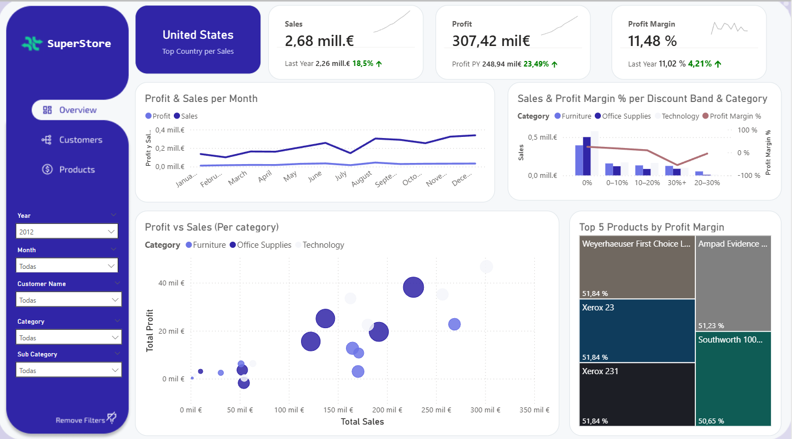  


## Project Overview
This project transforms a flat sales dataset into a professional, relational data model (Star Schema) to analyze business performance. The goal was to clean, normalize, and visualize sales, customer, and product data for better decision-making.

**Dataset Source:** [Kaggle - Superstore Sales Dataset](https://www.kaggle.com/datasets/laibaanwer/superstore-sales-dataset)

---

## Technical Skills Applied
* **Power Query (M):** Data cleaning, parameters, and custom functions.
* **Data Modeling:** Implementation of Star Schema and relationships (1:N).
* **DAX:** Basic and intermediate measures for business logic.
* **UI/UX Design:** Navigation menus, synchronized slicers, and field parameters.

---

## Data Transformation (Power Query & M)

The original dataset consisted of a single flat table. Using **Power Query**, I redesigned the architecture into a **Star Schema** to improve performance and scalability.

### ETL Process:
1.  **Dynamic Path:** Created a parameter for the source file path to make the report easily portable.

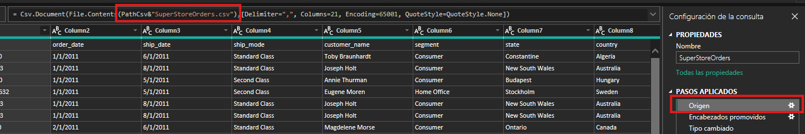
 
2. **Normalization:** Standardized numerical formats and regional settings to ensure data integrity.
3.  **Calculated Columns:** Created new business metrics:
    * `Price` = `[Sales] / [Quantity]`
    * `Net Sales` = `[Sales] * (1 - [Discount])`
4.  **Table Factoring:** Generated dimension tables by duplicating the original source, removing unnecessary columns, deleting duplicates, and adding Unique IDs. These IDs were then merged back into the Fact table.  
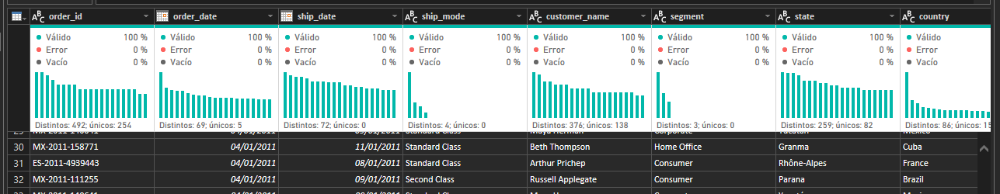  
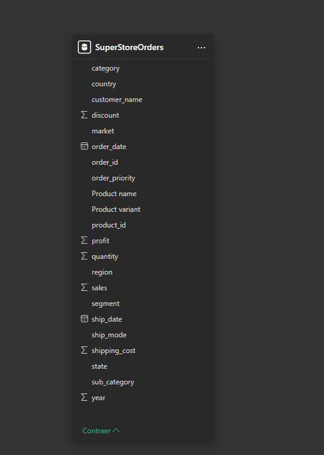  

5. Created folders to organize the different tables in PowerQuery.  
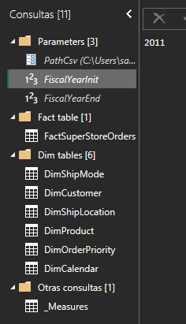

### Data Model
#### Star Schema  

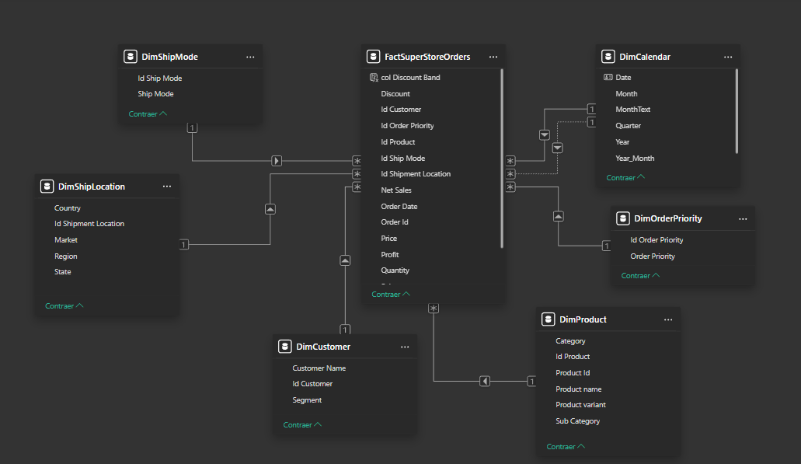

The model consists of the following tables:
* **FactSuperStoreOrders:** The central table containing metrics and foreign keys.
* **DimShipMode:** Shipping methods.
* **DimCustomer:** Customer names and segments.
* **DimShipLocation:** Geographic data (State, Country, Market, Region).
* **DimProduct:** Categories, sub-categories, and product details.
* **DimOrderPriority:** Levels of order priority.
* **DimCalendar:** A custom calendar table created in **M** using dynamic parameters (`FiscalYearInit` and `FiscalYearEnd`) based on the order dates.
```  
    FiscalYearInit = Date.Year(List.Min(FactSuperStoreOrders[Order Date]))

    FiscalYearEnd = Date.Year(List.Max(FactSuperStoreOrders[Order Date]))
```

```
let
    // Configuracion
    InicioCalendario= #date(FiscalYearInit,1,1),
    FinCalendario = #date(FiscalYearEnd,12,31), 

    //Lista de fechas
    Origen=List.Dates(
        InicioCalendario,
        Duration.Days(FinCalendario-InicioCalendario)+1,
        #duration(1,0,0,0)
    ),

    //Columnas principales
    TablaDesdeLista = Table.FromList(Origen, Splitter.SplitByNothing(), null, null, ExtraValues.Error),
    ColumnaRenombrada = Table.RenameColumns(TablaDesdeLista,{{"Column1", "Date"}}),
    TipoCambiado = Table.TransformColumnTypes(ColumnaRenombrada,{{"Date", type date}}),
    AñoInsertado = Table.AddColumn(TipoCambiado, "Year", each Date.Year([Date]), Int64.Type),
    TrimestreInsertado = Table.AddColumn(AñoInsertado, "Quarter", each Date.QuarterOfYear([Date]), Int64.Type),
    MesInsertado = Table.AddColumn(TrimestreInsertado, "Month", each Date.Month([Date]), Int64.Type),
    AñoTrimestreInsertado = Table.AddColumn(MesInsertado, "Year_Quarter", each Number.ToText([Year])&"-"&Text.From([Quarter]), type text),
    AñoMesInsertado = Table.AddColumn(AñoTrimestreInsertado, "Year_Month", each Number.ToText([Year])&"-"&Text.End("0"&Text.From([Month]),2), type text),
    MonthText = Table.AddColumn(AñoMesInsertado, "MonthText", each Date.MonthName([Date], "en-US"), type text)
    
in
    MonthText
```
---


---
## Data Visualization

### Interactive Features:
* **Navigation:** Buttons located at the top-left corner for seamless page switching.
* **Slicers Panel:** A dedicated left-side panel for filtering data by date and other attributes.
* **Search Bars:** Text-based slicers to find specific customers or products quickly.
* **Field Parameters:** Dynamic dimensions in the Customer and Product pages, allowing users to switch perspectives (e.g., changing the axis of a chart dynamically).
```
FP_CustomerFilters = {
    ("Customer Name", NAMEOF('DimCustomer'[Customer Name]), 0),
    ("Segment Customer", NAMEOF('DimCustomer'[Segment]), 1),
    ("Country Shipment", NAMEOF('DimShipLocation'[Country]), 2)
}

FP_ProductPerformance = {
    ("Profit", NAMEOF('_Measures'[Profit Sum]), 0),
    ("Sales", NAMEOF('_Measures'[Sales Sum]), 1)
}
```

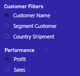  
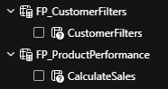  

* **Custom Tooltips:** Enhanced visual objects with report-page tooltips to provide deeper context and detailed 
information without cluttering the main view.  
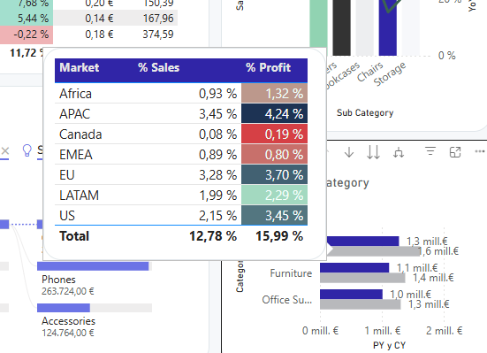   
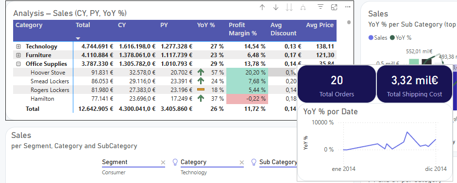   
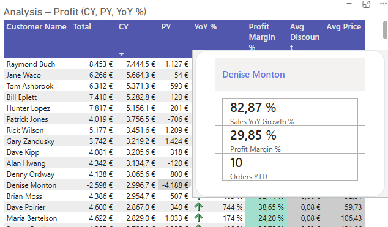   

### Pages:
The report is divided into three specialized pages with an intuitive navigation system. 
### 1. **Main:** High-level overview of general KPIs.  
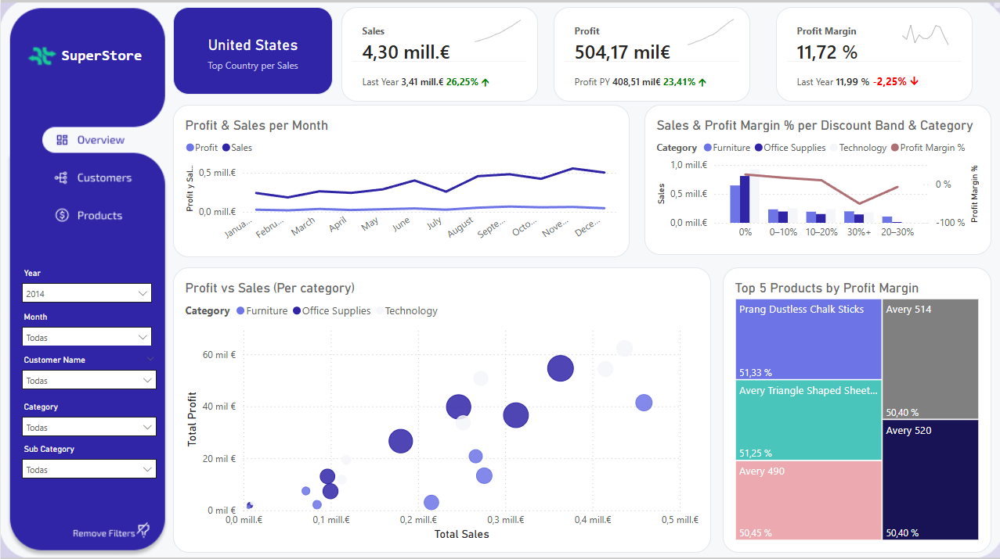


This dashboard provides a high-level view of sales and profitability, with a strong focus on year-over-year performance and key business drivers.

#### What this report shows

* **Top Country by Sales**, highlighting the best-performing market.

  * **Sales, Profit and Profit Margin KPIs**, each compared with the previous year (PY), to quickly assess growth and profitability trends.

  * **Monthly Sales and Profit trends**, used to identify seasonality and performance changes over time.

  * **Discount Band analysis by Category**, showing how different discount levels impact both sales volume and profit margin.

  * **Top 5 Products by Profit Margin**, focusing on high-value products rather than only high sales.

  * **Sales vs Profit scatter analysis**, comparing categories and markets by sales, profit and quantity sold.

#### Business questions answered

* Are sales and profit improving compared to last year?

  * Which markets and categories drive the most value?

  * How do discounts affect profitability?

  * Which products generate high margin versus high volume but low profit?

#### Dax 
* Column in FactSuperStoreOrders
```
col Discount Band = 
SWITCH(
    TRUE(),
    FactSuperStoreOrders[Discount] = 0, "0%",
    FactSuperStoreOrders[Discount] <= 0.10, "0–10%",
    FactSuperStoreOrders[Discount] <= 0.20, "10–20%",
    FactSuperStoreOrders[Discount] <= 0.30, "20–30%",
    "30%+"
)
```
* Measures
```
Top Country per Sales = 
CONCATENATEX(
    TOPN(
        1,
        VALUES(DimShipLocation[Country]),
        [Sales Sum],
        DESC
    ),
    DimShipLocation[Country]
)

Profit Sum = 
SUM(FactSuperStoreOrders[Profit])

Sales Sum = 
SUM(FactSuperStoreOrders[Sales])

Sales KPI = 
VAR _SelectedYear = SELECTEDVALUE(DimCalendar[Year])
VAR _lastYear = MAX(DimCalendar[Year])
VAR _sales = SUM(FactSuperStoreOrders[Sales])
RETURN
CALCULATE(_sales,
    DimCalendar[Year] = COALESCE(_SelectedYear,_lastYear)
)

Profit KPI = 
VAR _SelectedYear = SELECTEDVALUE(DimCalendar[Year])
VAR _lastYear = MAX(DimCalendar[Year])
RETURN
CALCULATE([Profit Sum],
    DimCalendar[Year] = COALESCE(_SelectedYear,_lastYear)
)

Profit Margin % = 
VAR _sales = SUM(FactSuperStoreOrders[Sales])
VAR _profit = SUM(FactSuperStoreOrders[Profit])
RETURN
DIVIDE(_profit, _sales)

Profit Margin % PY = 
VAR _sales = [Sales PY]
VAR _profit = [Profit PY]
RETURN
DIVIDE(_profit, _sales)
```
### 2.  **Customers:** Detailed analysis of client behavior and segments.  
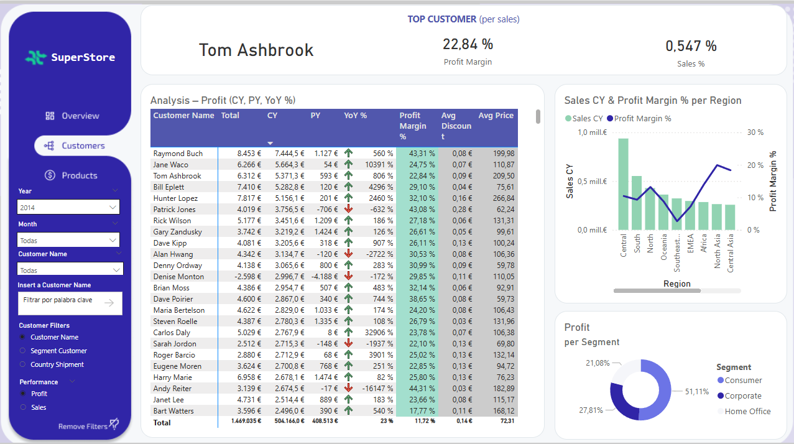  

This dashboard provides insights into top customers, profitability, and regional performance.

#### KPIs
- Top Customer by Sales with Profit Margin % and % of Total Sales of this customer

#### Regional Bar & Line Chart
- Sales vs Profit Margin % by region

#### Segment Analysis
- Pie chart using a field parameter (Sales or Profit)

#### Matrix
- Customer-level metrics including CY, PY, YoY %, Profit Margin %, Avg Discount, Avg Price
- Field parameters for Customer, Segment, and Country

#### Business Questions Answered
- Who are the most valuable customers and segments?
- Which regions drive revenue and profit?
- How do discounts and pricing affect profitability?

#### DAX measures
```
Top Customer per Sales = 
MAXX(
    TOPN(
        1,
        VALUES(DimCustomer[Customer Name]),
        [Sales Sum],
        DESC
    ),
    DimCustomer[Customer Name]
)

Top customer profit margin % = 
CALCULATE( 
    [Profit Margin %], 
    TREATAS(
        { [Top Customer per Sales] },
        DimCustomer[Customer Name]
    )
)

Top Customer Sales % = 
VAR _topCustomer = [Top Customer per Sales]
RETURN
CALCULATE(
    [Customer Sales %],
    TREATAS(
        { _topCustomer },
        DimCustomer[Customer Name]
    )
)

Selected Total = 
VAR _sales = 
CALCULATE(
    [Sales Sum],
    REMOVEFILTERS(DimCalendar)
)
VAR _profit =
CALCULATE(
    [Profit Sum],
    REMOVEFILTERS(DimCalendar)
)
VAR _Selected = MAX('FP_ProductPerformance'[CalculateSales])
RETURN
SWITCH(
    _Selected,
    "Profit", _profit,
    "Sales", _sales,
    BLANK()
)

Selected CY = 
VAR _cy_sales = 
    CALCULATE(
        [Sales Sum],
        DATESYTD(DimCalendar[Date])
    )
VAR _cy_profit =
    CALCULATE(
        [Profit Sum],
        DATESYTD(DimCalendar[Date])
    )

VAR _Selected = MAX('FP_ProductPerformance'[CalculateSales])
RETURN
SWITCH(
    _Selected,
    "Profit", _cy_profit,
    "Sales", _cy_sales,
    BLANK()
)

Selected PY = 
VAR _py_sales = 
    CALCULATE(
        [Sales Sum],
        SAMEPERIODLASTYEAR(DimCalendar[Date])
    )
VAR _py_profit =
    CALCULATE(
        [Profit Sum],
        SAMEPERIODLASTYEAR(DimCalendar[Date])
    )

VAR _Selected = MAX('FP_ProductPerformance'[CalculateSales])
RETURN
SWITCH(
    _Selected,
    "Profit", _py_profit,
    "Sales", _py_sales,
    BLANK()
)

Selected YoY % = 
VAR _cy_sales = [Sales CY]
VAR _py_sales = [Sales PY]
VAR _cy_profit = [Profit CY]
VAR _py_profit = [Profit PY]

VAR _Sales_yoy =
    IF(
        NOT ISBLANK(_py_sales) && _py_sales <> 0,
        DIVIDE(_cy_sales - _py_sales, _py_sales),
        BLANK()
    )

VAR _Profit_yoy =
    IF(
        NOT ISBLANK(_py_profit) && _py_profit <> 0,
        DIVIDE(_cy_profit - _py_profit, _py_profit),
        BLANK()
    )

VAR _Selected = MAX('FP_ProductPerformance'[CalculateSales])

RETURN
SWITCH(
    _Selected,
    "Profit", _Profit_yoy,
    "Sales", _Sales_yoy,
    BLANK()
)

Avg Discount = 
AVERAGE(FactSuperStoreOrders[Discount])

Avg Price = 
AVERAGE(FactSuperStoreOrders[Price ])

```

### 3.  **Products:** Insights into category performance and product variants.

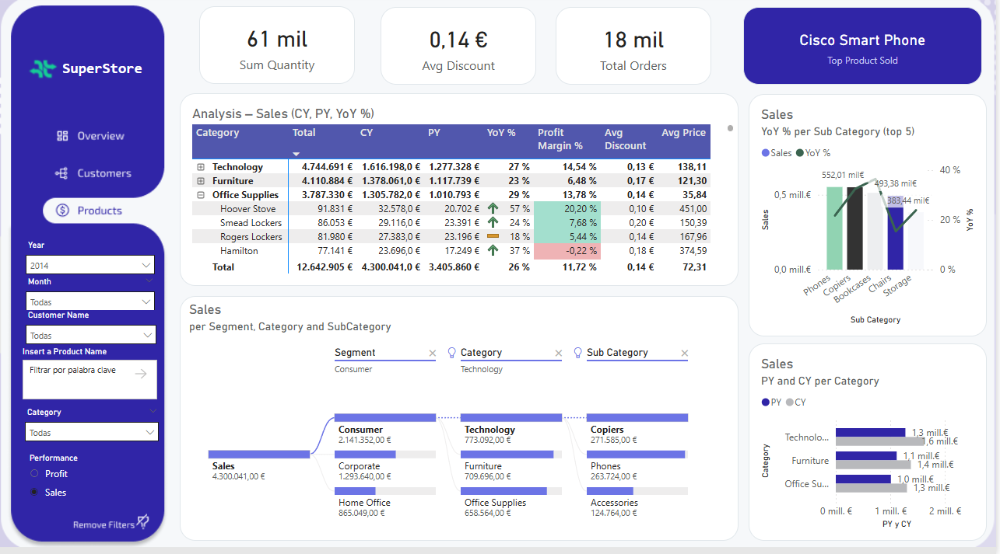  

#### Products Page

This dashboard focuses on product-level performance and allows flexible analysis using a field parameter for Performance (Sales or Profit).

#### KPIs
- Total Quantity Sold
- Average Discount
- Total Orders
- Top Product Sold

#### Matrix
- Rows: Category and Product Name
- Columns: Total (all-time), CY, PY, YoY %, Profit Margin %, Avg Discount, Avg Price
- Field parameter for Performance (Sales or Profit)

#### Hierarchical Analysis
- Field parameter "CalculateSales" allows exploring either Sales or Profit across multiple levels: Segment → Category → Subcategory
- Users can drill down to see performance by segment, category, and subcategory
- Supports quick identification of top-performing segments, categories, and subcategories in terms of Sales or Profit

#### Visuals
- **Grouped Bar Chart**: Category and Product Name on Y-axis; CY and PY (Sales or Profit) on X-axis
- **Grouped Column & Line Chart**: Subcategory on X-axis; Column = CalculateSales (Sales or Profit); Line = YoY %

#### Business Questions Answered
- Which products, categories, and subcategories generate the most revenue or profit?
- How does performance differ across segments and hierarchies?
- How do discounts and order quantities impact profitability?

#### DAX measures
```
Total Orders = COUNTROWS(FactSuperStoreOrders)

Top Product = 
CONCATENATEX(
    TOPN(
        1,
        VALUES(DimProduct[Product name]),
        [Sales Sum],
        DESC
    ),
    DimProduct[Product name]
)

Sum Quantity = SUM(FactSuperStoreOrders[Quantity])
```


